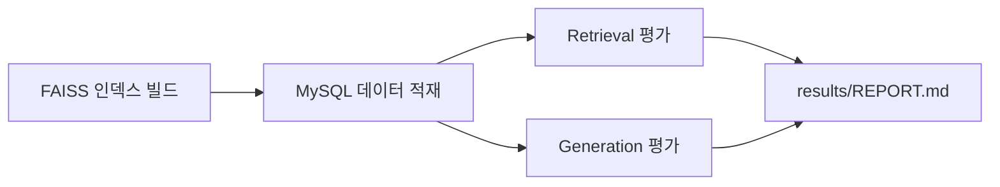

# 🧪 Job-Pocket RAG 평가 시스템

> **목적**: HybridRetriever의 검색 품질과 RAG 파이프라인의 생성 품질을 정량적으로 평가한다.

---

## 📁 디렉토리 구조

```
evaluation/
├── README.md                       # 본 문서
├── datasets/
│   └── golden_qa.jsonl            # 평가 정답 셋
├── utils.py                        # 공용 유틸 (로딩, 지표 계산)
├── run_retrieval_eval.py          # Retrieval 평가 스크립트
├── run_generation_eval.py         # Generation 평가 스크립트
└── results/
    ├── REPORT.md                   # 통합 리포트
    ├── retrieval_metrics.json     # Retrieval 실행 결과
    └── generation_metrics.json    # Generation 실행 결과
```

---

## 🚀 빠른 시작

### 1. 선결 조건

```bash
# 필수 - backend 환경 설정
cd job-pocket
pip install -r docker/backend/requirements.txt

# 필수 - FAISS 인덱스 빌드
python scripts/embed/build_faiss_index.py    # v0.3.0 이후 가능

# 필수 - MySQL 데이터 적재
python scripts/load/load_applicant_records.py  # v0.3.0 이후 가능

# 환경변수 설정
export OPENAI_API_KEY=sk-...
export HOST=localhost
export PORT=3306
export USER=vector_user
export PASSWORD=vector_password
export DB=job_pocket_vector
```

### 2. 실행

```bash
# Retrieval 평가만
python evaluation/run_retrieval_eval.py

# Generation 평가만
python evaluation/run_generation_eval.py --limit 10

# 옵션
python evaluation/run_retrieval_eval.py --help
```

### 3. 결과 확인

```bash
cat evaluation/results/REPORT.md
```

---

## 📊 평가 지표

### Retrieval 지표

| 지표 | 의미 | 목표 |
|---|---|---|
| Recall@3 | 정답이 상위 3개 안에 포함 비율 | ≥ 0.60 |
| Recall@5 | 상위 5개 안에 포함 비율 | ≥ 0.75 |
| MRR | 정답의 평균 역순위 | ≥ 0.45 |
| nDCG@3 | 순위 가중 누적 점수 | ≥ 0.55 |

### Generation 지표

| 지표 | 의미 | 목표 |
|---|---|---|
| 품질 통과율 | `score_local_draft` 1회 통과 | ≥ 75% |
| 재생성 횟수 평균 | 품질 통과까지 시도 횟수 | ≤ 1.3 |
| 과장 표현 포함률 | 9종 금지 표현 포함 | ≤ 5% |
| 글자수 달성률 | char_limit ±15% 이내 | ≥ 90% |
| LLM-as-Judge 점수 | 5점 척도 평균 | ≥ 3.5 |

---

## 📝 골든 셋 구축

### 포맷 (`datasets/golden_qa.jsonl`)

각 줄은 하나의 JSON 객체:

```json
{
  "query_id": "Q001",
  "user_profile": {
    "school": "...",
    "major": "...",
    "exp": "...",
    "awards": "...",
    "tech": "..."
  },
  "company": "네이버",
  "job": "백엔드",
  "question_type": "motivation",
  "relevant_doc_ids": [12, 47, 89],
  "annotator_note": "..."
}
```

### 구축 절차

1. 수집된 자소서 데이터(`applicant_records`)를 훑어 품질 좋은 케이스를 선정
2. 각 케이스에 대해 가상의 사용자 프로필 구성
3. `relevant_doc_ids`에 어노테이터가 "이 프로필에 유사하다"고 판정한 문서 ID 입력
4. 20~30건 이상 작성 권장

---

## 🔧 CLI 옵션

### `run_retrieval_eval.py`

```
python evaluation/run_retrieval_eval.py [옵션]

Options:
  --dataset PATH       골든 셋 경로 (기본: datasets/golden_qa.jsonl)
  --output PATH        결과 JSON 경로 (기본: results/retrieval_metrics.json)
  --top-k INT          Recall@K의 K 값 (기본: [3, 5, 10])
  --limit INT          처음 N개만 실행 (테스트용)
```

### `run_generation_eval.py`

```
python evaluation/run_generation_eval.py [옵션]

Options:
  --dataset PATH       골든 셋 경로
  --output PATH        결과 JSON 경로
  --model NAME         사용할 모델 (기본: GPT-4o-mini)
  --judge-model NAME   평가자 LLM (기본: gpt-4o-mini)
  --limit INT          처음 N개만 실행
  --skip-judge         LLM-as-Judge 스킵 (비용 절감)
```

---

## 💰 비용 관리

LLM 기반 평가는 API 비용이 발생한다. 참고:

| 평가 범위 | 예상 비용 |
|---|---|
| Retrieval만 | $0 (로컬 임베딩) |
| Generation 30건 (judge 포함) | ~$1 |
| 전체 평가 1회 | ~$2 |

**권장 주기**: 주 1회 또는 릴리스 직전.

---

## 🎯 실행 순서 (v0.3.0 기준)



---

## ❓ FAQ

**Q. 골든 셋이 작을수록 의미 있나요?**  
A. 20건 미만은 통계적 유의성 낮음. 30건 이상 권장. 단, 방향성 확인용이라면 10건으로 시작 가능.

**Q. LLM-as-Judge 신뢰도는?**  
A. GPT-4 계열은 일관성 높으나 자기 편향 존재. 생성 모델과 평가 모델을 다르게 선택 권장 (예: EXAONE 생성 → GPT-4o 평가).

**Q. 시간이 얼마나 걸리나요?**  
A. Retrieval 30건: ~1분. Generation 30건 (judge 포함): ~10분.

---

## 📖 관련 문서

- `docs/wiki/model/test.md` — RAG 평가 방법론
- `docs/wiki/test/test_plan.md` — 전체 테스트 전략
- `docs/wiki/model/rag_pipeline.md` — 파이프라인 상세
